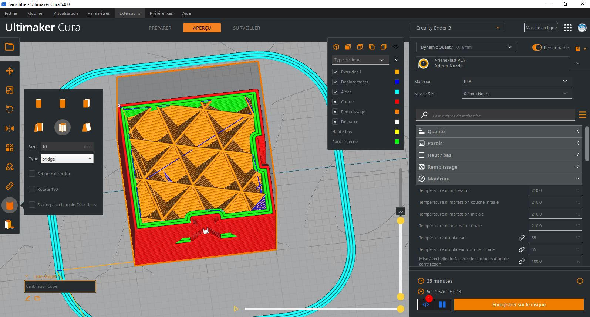
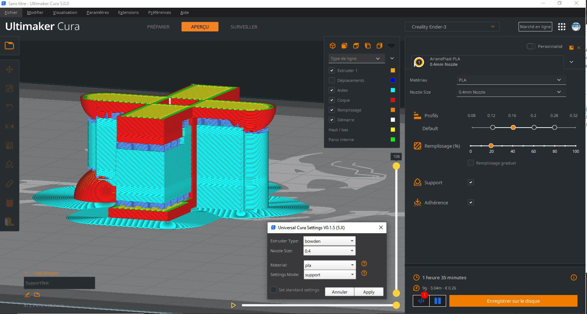

# 5axes Cura Theme (cura-by_5@xes)

My Cura Theme, Updated for Cura 5.0. Based on the [Ultimaker Dark Theme](https://github.com/Ultimaker/Cura/blob/master/resources/themes/cura-dark/theme.json)

Note : The non standard menu displayed in the images bellow are due to the use of the excelent [Cura Sidebar GUI Plugin](https://github.com/fieldOfView/Cura-SidebarGUIPlugin) from [Aldo Hoeben](https://github.com/fieldOfView). This plugin replaces collapsible settings panel in Cura 4.x & Cura 5.X with a sidebar like the previous versions. 

## Features

Support Non-transparent

Special color for moves 
* Moves with retraction are in Orange 
* Moves without retraction are in Blue
